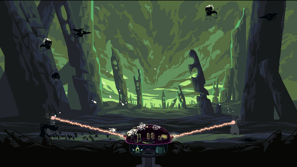
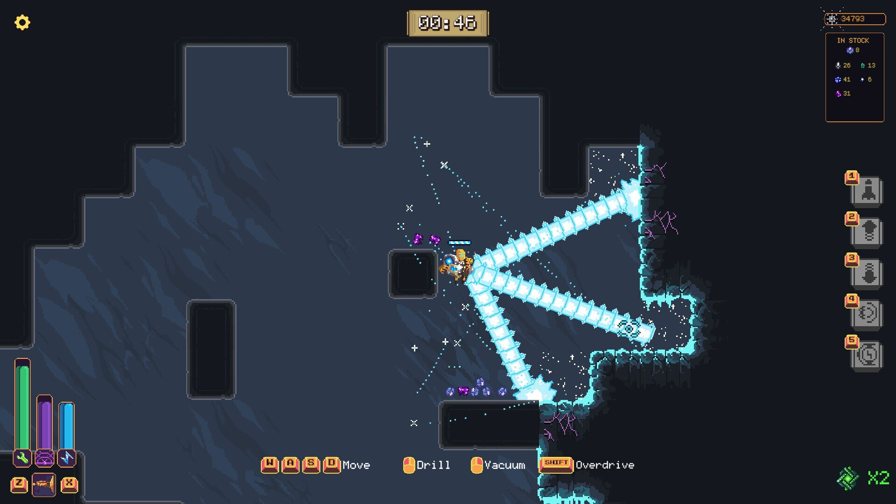
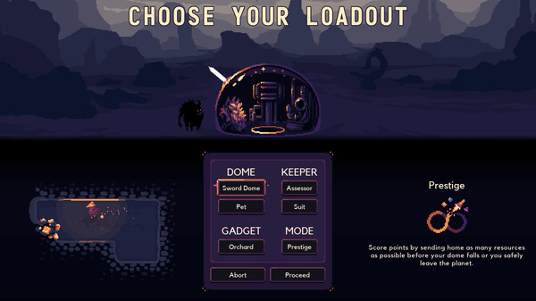
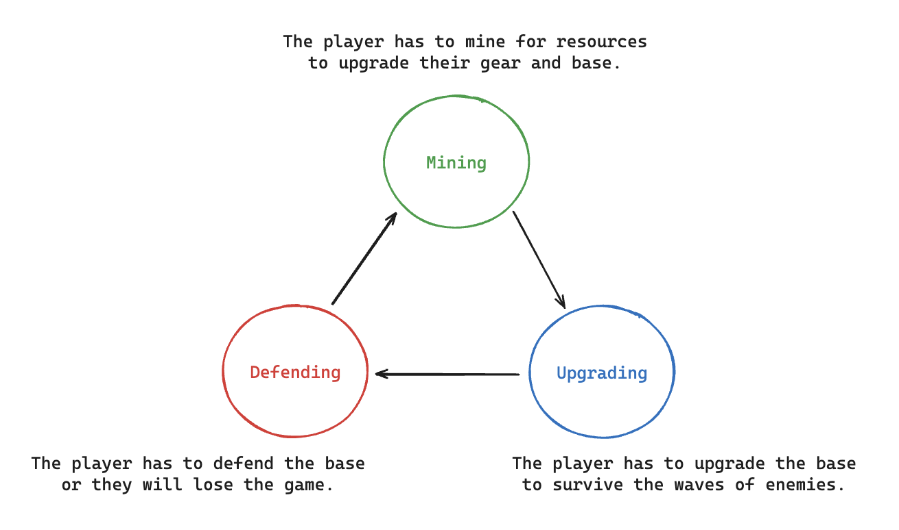
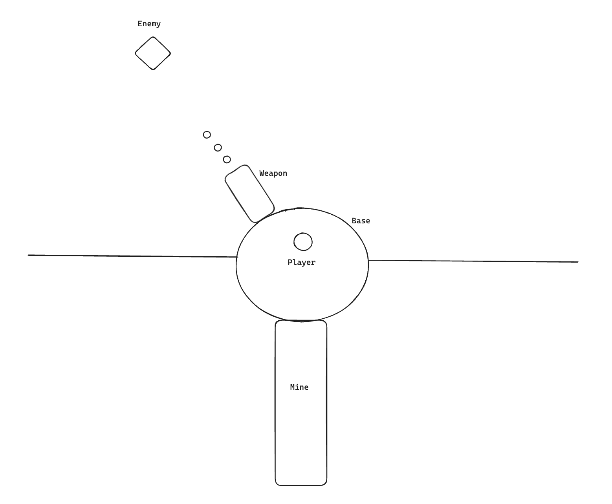
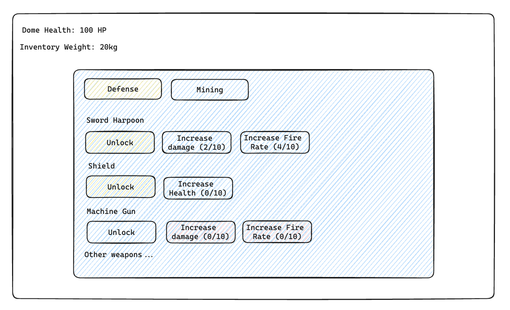
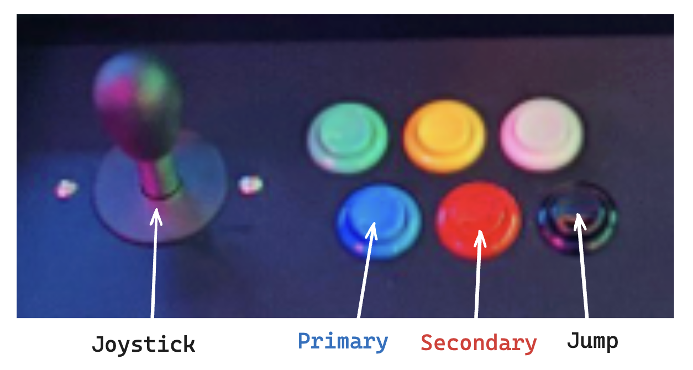

# Dome Defender

---

## Concept

### Pitch

Dome Defender is a Roguelike Tower Defense game, where you need to quickly mine for resources, inbetween waves of enemies, to upgrade your equipment and survive.

### Genres

- Roguelike
- Tower Defense

### Inspiration

The concept of the game is inspired by other Roguelike & Tower Defense games, like Dome Keeper and Wall World.

[**_Dome Keeper_**](https://store.steampowered.com/app/1637320/Dome_Keeper/)

_The following concepts are inspired by Dome Keeper_

- Waves of mobs attacking your tower.
- Upgrading weapons and shields on your tower with resources.
- Mining down into the ground for resources between waves.

[**_Wall World_**](https://store.steampowered.com/app/2187290/Wall_World/)

_The following concepts are inspired by Wall World_

- Mining with the use of lasers.
- Moving around with a jetpack.

### Target Audience

The player of Dome Defender enjoys roguelike games that require time management and strategy. They enjoy the vertical progression (literally and figuratively), and exploring upgrades that allow them to survive the longest.

### Unique Selling Points

**_Time Mangement_**

The game requires time management and strategizing while mining for resources and defending the tower.

The game requires the player to make trade offs between mining for resources and defending the tower.

**_Exploration_**

The game is a tower defense, of a tower that doesn't move, but the player can explore the resources available in the ground.

---

## Product Design

### Player Experience

The player is in a closed off dome. The player has a small amount of time to mine for resources before the next wave of enemies. They will use the resources to buy weapons and shields to defend the tower.

The player will be punished for poor time management and strategy, but will feel a sense of accomplishment when they survive longer and longer.

They will learn the best ways to mine for resources and the timing needed to get back to the tower in time for the next wave.

### Art Style

The game will have a retro pixel style art, but with modern lighting and effects. Similar to that of Dome Keeper.

### Game World

The player is trapped in a dome on an alien planet. The dome is the only safe place from the alien creatures that roam the planet. The player must defend the dome from the creatures. The ground is rich with resources, maybe they can be used to improve the dome and escape.

### Monetization

The game will be a one-time purchase on various platforms.

### Platform, Technology and Scope

2D game made in Unity and built for the VIA Arcade Machine. The game will be made by a singular developer and be made over the course of 3 months.

---

## System Design

### Core Loops

Underneath is an illustration of the core loop of the game.

The players goal is to survive the longest, and to do this, will have to optimize each part of the loop. While also strategizing and managing time.

### Objectives and Progression

The core objective of the game is to survive as many waves as possible. Which gets increasingly difficult as the waves go on.

The player starts in the dome with a set amount of time until the first wave starts. In this time they will have to mine for resources to get a weapon on their base, so they can survive the first wave.

After defending the base from the first wave they will have a chance to go mining for resources again. This time they can choose to upgrade mining gear, weapons or shields.

Depending on their confidence from their first wave, they might choose to mine for resources for a longer time, or to get back to the base quicker. They might prioritize mining gear over weapons or shields, or vice versa.

### Game Systems

**_Base_**
A system for the player to control weapons on the base, to defend against the enemies.

A system to control the health of the base.

**_Enemies_**
A system for the enemies to move towards and attack the base.

A system to control the health of the enemies.

**_Waves_**
A wave system that spawns enemies on a timer, and gets increasingly difficult to defend against.

**_Movement_**
A movement system that allows the player to move around the base and in the mine.

The player will be equipped with a jetpack to easily move around in the mine.

The players mobility will be affected by the weight of their inventory.

**_Resources_**
A system that spawns resources in the ground.

A system that allows the player to pick up items.

A system that allows the player to deposit resources in the base.

**_Mining_**
A mining system that allows the player to mine for resources in the ground.

**_Inventory_**
An inventory system that allows the player to carry resources back to the base.

**_Upgrades_**
A system that allows the player to upgrade their weapons, shields and mining gear.

### Interactivity

#### UI

**_Upgrades Menu_**

#### Controls

**_Primary_**
The _Primary_ button will **shoot mining lasers**, when not controlling the base or in a menu.

The _Primary_ button will **shoot weapons**, when controlling the base.

The _Primary_ button will **buy upgrades** when in the Upgrades Menu.

**_Boost_**
The _Boost_ button will make the player **move with a jetpack**, when not controlling the base or in a menu.

**_Joystick_**
The _Joystick_ will **rotate the player** when not controlling the base or in a menu.

The _Joystick_ will **move the base weapons**, when controlling the base.

The _Joystick_ will **navigate the menus**, when in the menus.

#### Emotions

The player will feel a sense of accomplishment when they survive longer and longer.

The player will feel a sense of urgency when they are mining for resources and the next wave is about to start.

The player will feel a sense of fear when they are defending the base from the waves of enemies.

#### Short-Term Cognitive Load

- Efficiently dealing with the enemies in the current wave.
- Deciding how long to mine for resources.
- Deciding what to mine for resources.
- Deciding when to return to the base.
- Deciding what to upgrade.

#### Long-Term Cognitive Load

- Learning the best ways to mine for resources.
- Learning the best ways to defend the base from the waves of enemies.
- Learning the best ways to upgrade.
- Learning the best ways to strategize and manage time.

---

## Project Miletones

**1. Movement and Mining System**

- Player Movement
- Laser Controlling
- Laser Mining
- Terrain Generation
- Chunk Loading
- Resource Spawning
- Item Collection
- Inventory System

**2. Base and Enemies System**

- Base Health
- Base Weapons
- Base Weapon Controlling
- Base Weapon Shooting
- Enemy Spawning
- Enemy Movement
- Enemy Health
- Wave System

**3. Upgrades System**

- Upgrades Menu (UI)
- Upgrades Buying (Spending resources)
- Upgrades Applying
  -- Base Upgrades (Shield & Weapons)
  -- Mining Upgrades (Movement & Lasers)

---
