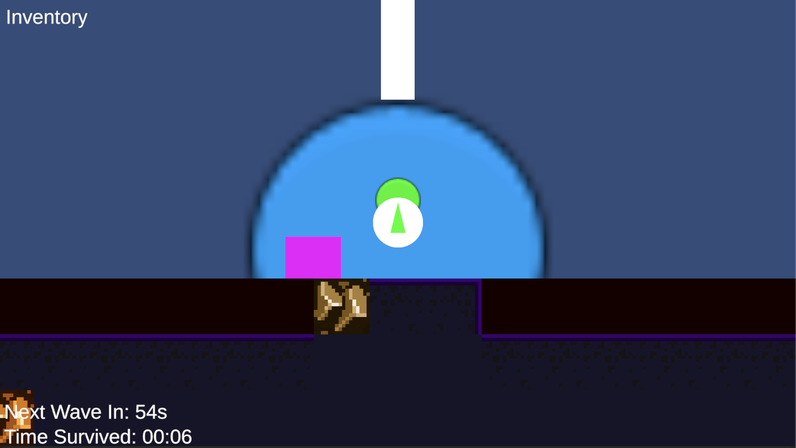
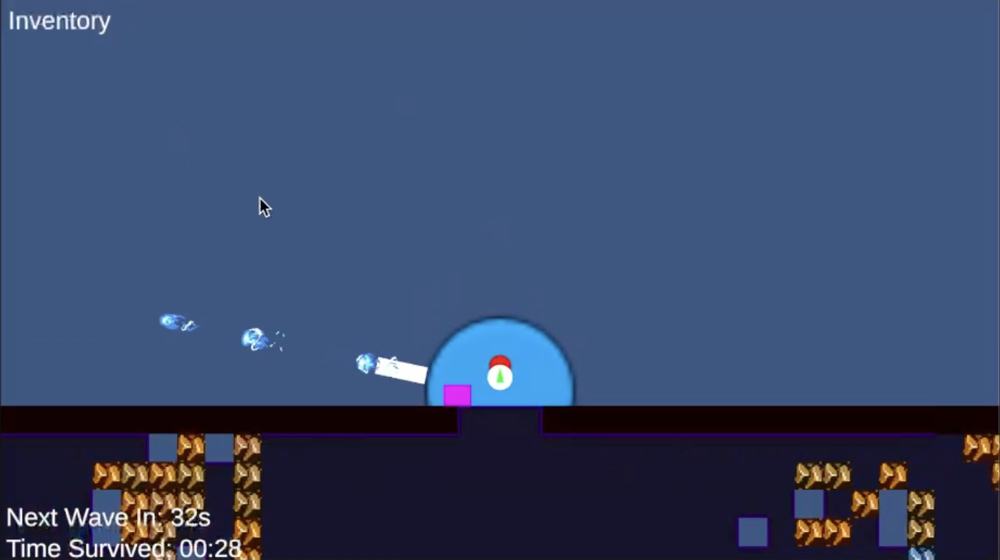
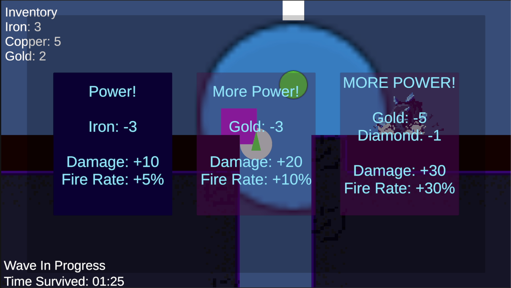
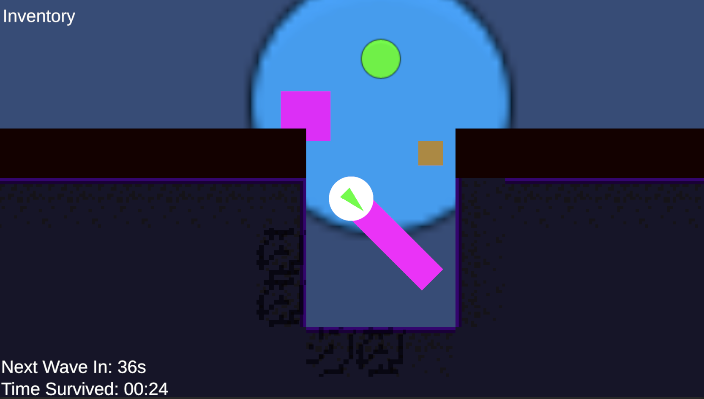
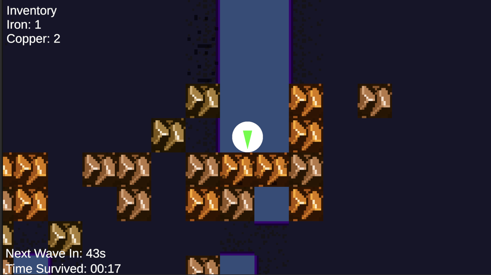
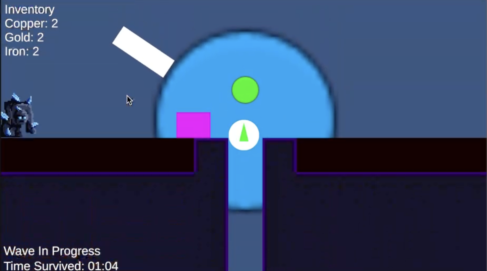
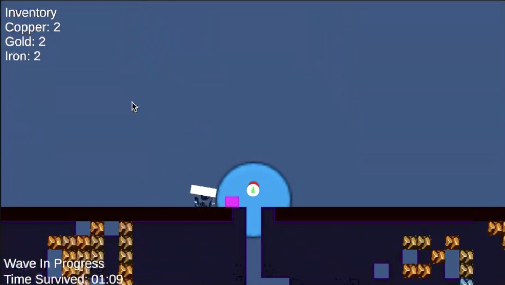

# The Game

Let's take a look at the games mechanics.

> [!NOTE]
> The controls are defined in the game design document.

This is the how the game starts.

The player is the white circle with a green triangle inside, which is the player's drill.

The is inside their base, that has a mounted weapon. Inside the base there is a green circle and a pink square. The green circle is the control center and the pink square is the shop.

Taking control of the control center, by interacting, will give the player control of the tower.

The camera zooms out for a better view and the control center turns red, indicating that the player is in control of the tower.

The player can move the weapon using the movement keys and fire projectiles using the primary fire.

As displayed in the bottom left the next wave spawns in x amount of time. And there is a counter of time survived, so the goal is probably to survive as long as possible.

Let's take a look at the shop in the tower.

The shop has upgrades for the tower. Which can be navigated with movement keys and bought with a submit button. In the image the player already have resources to buy the first upgrade. But how do you obtain resources? By mining of course!

Conviniently there is a hole in the top layer of bedrock (the black layer) that the player can use to mine.

Using the primary fire the player shoots it's laser drill, and can destroys the rocks. If the player mines far enough they will most likely finds veins or ores.

These ores drop an item when mined, which can be picked up by the player. This puts the item in the player's inventory. And they can then rush back to the base and upgrade the base before the wave starts.

In the first wave a single golem spawns, approaching the base, to attack it. If the tower loses all it's health the game is over.

If the player was too late to use the projectiles to kill the golem, they can swing the weapon back and forth to melee the golem.

When all the golems are dead for this wave, they timer for the next wave will start. Probably best to use this time to mine and upgrade the base.

# Reflections

I'm very happy with the game overall, and I'm glad I got the core mechanics working. But there are a lot of things that could be improved, especially in the code.

## Terrain Generation

I'm very proud of the terrain generation system and chunk managing. It was a fun technical challenge. I would like to fine adjust the ore spawning, so that the veins feel more natural and less common, like in Minecraft, but larger. Since they would be less common, I would like to make the player mine faster, which I think would make the game more fun, since the mining part feels slow even with the lage amount of ores.

I would also like the rarer ores to spawn deeper, so that the player has to mine deeper to get the best ores. This would make the player have to balance the risk of going deeper with the reward of better ores.

From a technical stand point, I'm not sure that creating this many gameobjects for the terrain is a good idea for performance. Since I'm currently just disabling the chunk when it's out of view. There might be smarter tricks to emulate chunk loading, without keeping all gameobjects in memory.

## Wave System

The wave system is very bare bones. It currently just has 3 waves with increasing amount of enemies. And then it just loops around when all waves are completed. I would like to add more waves, with different enemies and maybe even bosses. And then scale the enemy stats for each loop of the waves.

## Upgrades System

Currently the upgrades system simply mutates the field-variables on the tower weapon. This is not ideal, since it's not very flexible. I would like to have the upgrades be somthing like a ScriptableObject, that is stored in the players inventory. This would make it easy to combine upgrades, add and remove upgrades and make upgrades for different weapons.

## General Structure

The further I got into my development, I started to dislike my structure. Everything felt a little too coupled, but not enough to rewrite the whole thing. I would like to make everything event based with ScriptableObject variables. Then most components would only interact through triggering and subscribing to events, totally decoupling these parts. A place where this would be very useful is the UI, which is currently very coupled with the components.
