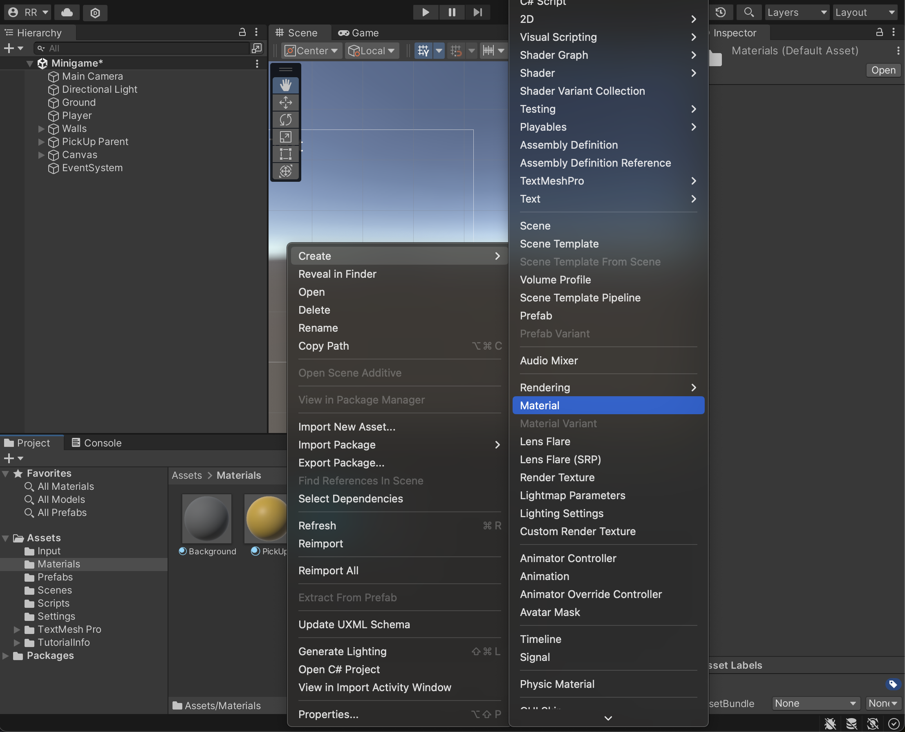
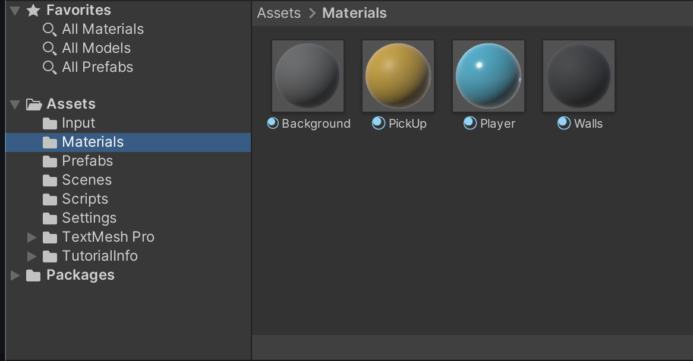
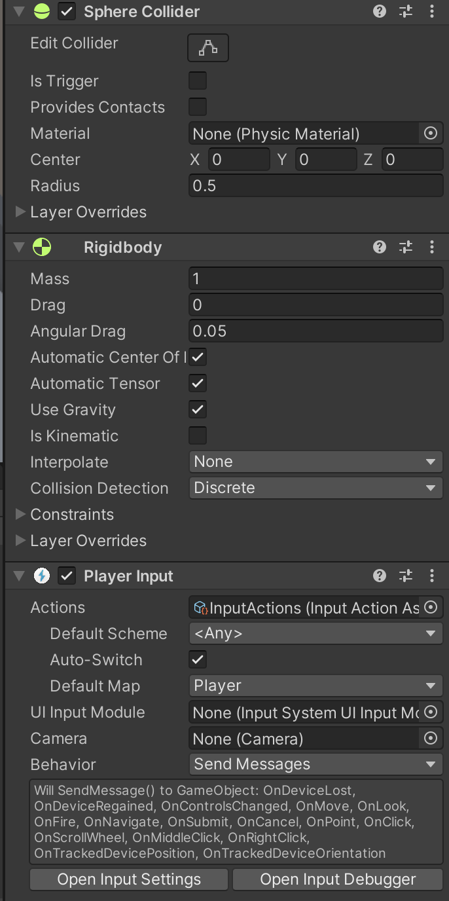

# Roll-a-Ball

> [Link to my Game](https://reinhardtr.github.io/GMD1-Roll-a-Ball)

## Introduction

For my first Unity project I followed a tutorial by Unity called [Roll-a-Ball](https://learn.unity.com/tutorial/building-the-game?uv=2022.3&projectId=5f158f1bedbc2a0020e51f0d#).

## Creating a project

To start with I had to create my first project. Unity has a collection of templates you can use to bootstrap your project.

This game is gonna be a 3D game, so I wen't with the a 3D template. I used the URP since it allows the game to use high-end graphics supported my modern hardware (which this game is definitely gonna utilize).

## The Essential Game Objects

First task was creating some essential game objects. The Player, Ground and Walls. You can create Game Objects by right-clicking the _Hierachy_-tab.


The player is Ball, the ground is a plane and the walls are cubes. To change the colors of the Game Objects I created materials for the Game Objects. Again this can be done by simply right-clicking in the _Project_-tab.



I organized these materials in a _Materials_-folder, to not make a mess of my many assets.



## Moving the ball

What is a game if it isn't interactive. So give the player the ability to control the ball with keyboard inputs.

To do this we need to add a _behaviour_ to the Player Game Object. This is done by adding a _component_ to the Game Object.

Unity has a lot of built-in components, that you are free to use, e.g. the player has _Rigidbody_ component so it simulates physics properties.



You might also notice in the image, that it has a _Player Input_ component. This basically allows us to capture the user input in our scripts and react to it. This will be done in a _PlayerController_ script. Which I created by clicking _Add Component_ at the bottom of the _Inspector_-tab of the Player Game Object, and then save it in a Scripts folder.

> I've configured Unity to open scripts in VS Code, since it's my prefered IDE.

To store the movement of the ball I created a _Vector3_-field.

```csharp
private Vector3 movement;
```

Now to react to the user input I created a _OnMove_-method.

```csharp
void OnMove(InputValue movementValue)
{
    Vector2 movement2d = movementValue.Get<Vector2>();
    movement = new Vector3(movement2d.x, 0.0f, movement2d.y);
}
```

This method sets the movement values for the ball. But to actually move the ball, we add the force to the _Rigidbody_.

```csharp
private void FixedUpdate()
{
    rb.AddForce(movement * speed);
}
```

This is how [the docs](https://docs.unity3d.com/ScriptReference/MonoBehaviour.FixedUpdate.html) describe the _FixedUpdate_-method:

_"MonoBehaviour.FixedUpdate has the frequency of the physics system; it is called every fixed frame-rate frame"_

## Prefabs

Another interesting part of the tutorial was the concept of _Prefabs_.

In the game there is a bunch of _PickUps_ in the arena, which are just yellow squares, that the player can _pick up_.

Prefabs allow you to create a Reusable Game Object. E.g. the _PickUp_ Game Object has a _Box Collider_ component, to detect collision. But what if I wanted to use a _Capsule Collider_ instead?

If I didn't use a prefab I would have to go through all the PickUp Game Objects and change the component.

But If all the PickUp's are created from a PickUp-prefab, I can simply change it on the prefab and all the PickUps will reflect the change.

## Conclusion

The tutorial covered the basics of creating a basic game in the Unity engine. Besides the parts covered in this blog, it also went more in to depth with collisions, properties and GUIs. But this blog would be too long, so check out the tutorial for those concepts!

The tutorial was very simple and the parts seemed simple to use relative to the power of them.

I can definitely see the potential these tools have to make greater and more complex games!
